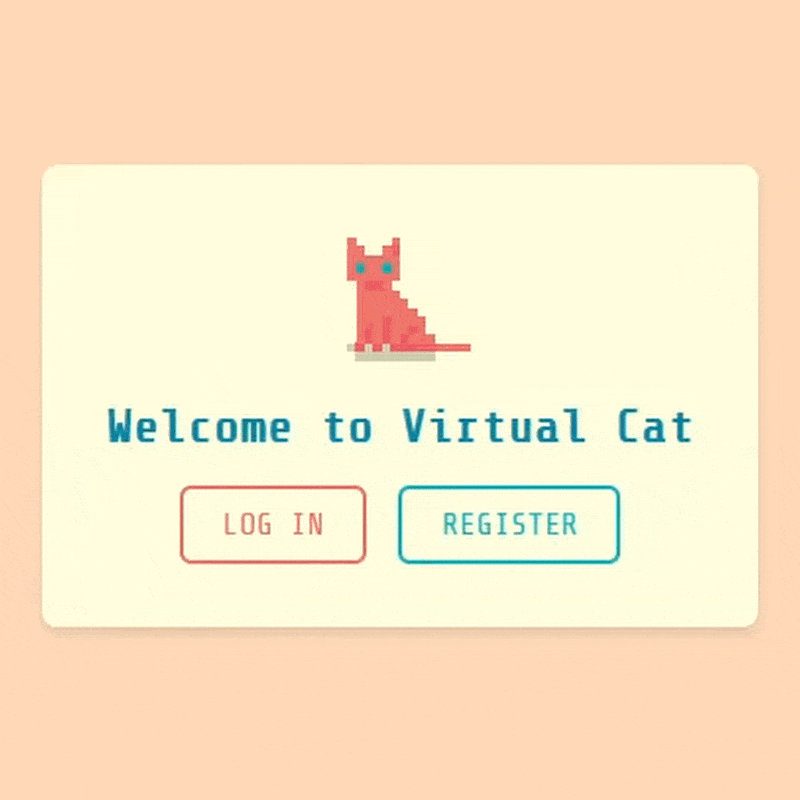
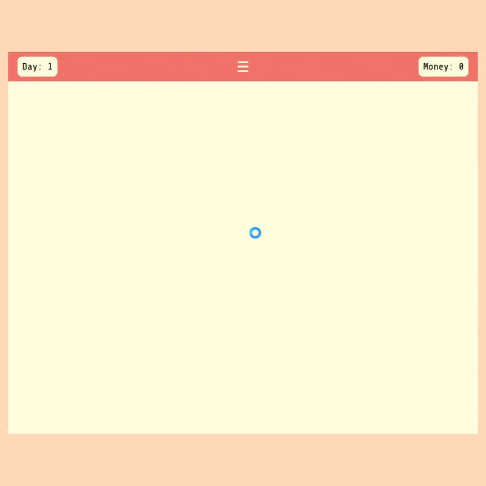

# Virtual Cat (Cat Shelter Simulator) 🐱🏠

An interactive cat shelter time management game built with Angular where you run your own cat shelter and prepare feline friends for their forever homes. Supported with Node.js, Express, MongoDB Atlas backend.




## Features

This project is under active development. Here's the current status of features:

### ✅ Implemented

- Basic user authentication (register and login)
- Interactive routes for login, register, and play

### 🚧 In Progress

- Interactive mini game for our first station, the bathtub
- Additional pixel arts and animation

### 📅 Planned

- Additional stations and minigames (blowdry, brush, feed, play, etc.)
- Progression system and gameplay loop (shelter upgrades, more care options, fail point, etc.)

### 🔄 Continuous Improvements

- Find and fix bugs, UI/UX improvements to ensure smooth user experience

## 🎮 Gameplay

Run your own cat shelter by:

- Welcoming in different stray cat friends
- Caring for them at different stations (feeding, grooming, playtime), preparing them for adoption
- Try not to fail the minigames, or you will hurt their feelings 😾

## 🛠️ Technologies

- Angular 19
- TypeScript
- Sass
- Node.js & Express backend
- MongoDB database

## 📋 Prerequisites

- Node.js (LTS version recommended)
- npm (comes with Node.js)
- Angular CLI (`npm install -g @angular/cli`)
- MongoDB (local or Atlas connection)

## 🔧 Installation

1. Clone the repository:

```bash
git clone https://github.com/your-username/cat-shelter-simulator.git
cd cat-shelter-simulator
```

2. Install dependencies:

```bash
npm install
```

3. Start the development server:

```bash
ng serve
```

4. Open your browser and navigate to `http://localhost:4200/`.

## 📖 Usage

- Register or log in to your account
- Manage incoming cats at your shelter
- Drag cats to different care stations and pass the minigames
